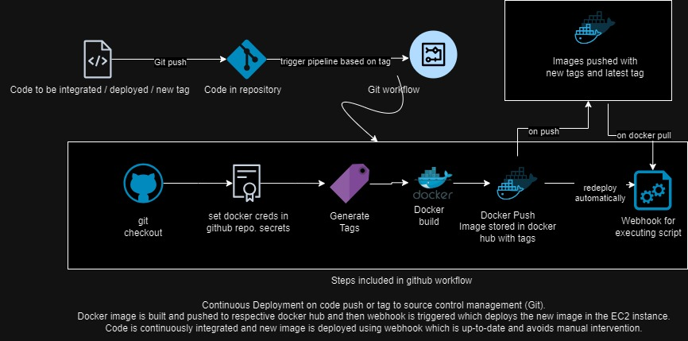

# Project 5
- Name: Pranav Ponugoti
- Email: ponugoti.16@wright.edu

## Part 1 - Semantic Versioning
## CD Project Overview
### What - Overview
- This continuous deployment (CD) project is designed to automate the building and publishing of Docker images to DockerHub upon the creation of a new Git tag in the repository.
- It aims to streamline the deployment process by generating image tags based on Git tags and pushing these tagged images to DockerHub.

### Why - Purpose
The purpose of this workflow is to automate the image build and deployment process to DockerHub whenever a new Git tag is created. It ensures consistent deployment of the latest tagged version and facilitates version control of Docker images.

### Tools Used
- GitHub Actions: For automation of the build and push process.
- Docker: For containerization and image creation.
- DockerHub: To host and store Docker images.

### Generating a Git Tag
To generate a Git tag in this repository, follow these steps:
1. Locally, run `git tag -a <tag_name> -m "Tag message"`
    - `git tag -a 1.2.0 -m "new tag"`
2. Push the tag to the remote repository using `git push origin <tag_name>`
  - `git push origin 1.2.0`

### Behavior of GitHub Workflow
This GitHub workflow is triggered when a new tag is pushed to the repository. Upon tag creation, it uses GitHub Actions to perform the following steps:
1. Checkout the repository's code.
2. Set up Docker Buildx and login to Docker Hub.
3. Use docker/metadata-action to generate image tags from the Git tag version and `latest`.
4. Build and push Docker images to DockerHub with the generated image tags.

### GitHub Workflow Execution
- The workflow executes automatically when a new Git tag is pushed to the repository.
- It utilizes GitHub Actions to perform the build and push operations, ensuring that the Docker images are updated on DockerHub with the latest tagged version.

## Docker Hub Repository
[Link to Docker Hub Repository](https://hub.docker.com/repository/docker/pranavponugoti16/docker-test)

## Part 2 - Deployment
### How to install Docker to your instance
- This is same as mentioned in README-CI.md
- I have installed docker and it's dependencies using commands on official docker documentation.
    - Using sudo apt-get, I have installed the docker and it's dependencies. Below is the source.
    - Commands are as follows:
```
# Add Docker's official GPG key:
sudo apt-get update
sudo apt-get install ca-certificates curl gnupg
sudo install -m 0755 -d /etc/apt/keyrings
curl -fsSL https://download.docker.com/linux/ubuntu/gpg | sudo gpg --dearmor -o /etc/apt/keyrings/docker.gpg
sudo chmod a+r /etc/apt/keyrings/docker.gpg

# Add the repository to Apt sources:
echo \
  "deb [arch="$(dpkg --print-architecture)" signed-by=/etc/apt/keyrings/docker.gpg] https://download.docker.com/linux/ubuntu \
  "$(. /etc/os-release && echo "$VERSION_CODENAME")" stable" | \
  sudo tee /etc/apt/sources.list.d/docker.list > /dev/null
sudo apt-get update
sudo apt-get install docker-ce docker-ce-cli containerd.io docker-buildx-plugin docker-compose-plugin
sudo docker run hello-world # to test working of docker using sample image
```

### Container restart script
#### Justification
- Restart script does removal of existing container, pull of new image and deploying the new image.
- This is achieved by using bash script. It can be written in any of the directory, then execute permission need to be provided.
- If permissions are not provided, the command is `bash <filename.sh>`, if permissions are provided using `sudo chmod 777 <filename.sh>` then the command to execute is `<filename.sh>` (which acts like command). `777` is given so that even webhook can execute at next stages else only `700` can be given. Note: All commands are executed from file path itself.
#### Description of what it does
- As part of this, pull the new image using following command.
    - `sudo docker pull pranavponugoti16/docker-test:latest`
- Then, we remove the stop the existing container first and then remove it off.
    - `sudo docker stop docker-site`
    - `sudo docker rm docker-site`
- Then spin the new container which uses new image pulled.
    - `sudo docker run -d --name docker-site -p 80:80 pranavponugoti16/docker-test`
- Steps 1 and 2 can be done vice verse, there is no dependency on one another. Step 3 has to be done at the end, as it uses new image and no exisitng container should be there with same name.
- I have deployed on 81 port for testing. It looks as follows:
- - 
#### Where it should be on the instance (if someone were to use your setup)
- Setup the docker as described in [Docker Installation](#how-to-install-docker-to-your-instance)
- Now, login to the dockerhub using creds: `docker login -u YOUR_USERNAME -p YOUR_PASSWORD`
- Then pull the image: `docker pull <image name>`, Eg: `docker pull pranavponugoti16/docker-test:latest`
- Then spin up the container: `sudo docker run -d --name docker-site -p 80:80 pranavponugoti16/docker-test`
- Now, write the script as described above in a file and run it, to deploy the site with latest images.
- This sums up, complete setup as well as deployment of latest images using script.

#### Setting up a webhook on the instance
1. How to install adnanh's webhook to the instance:
- To install webhook, we need to install `go` and `webhook` in the machine.
- Installation is as follows:
```
sudo apt-get install webhook  # installation of webhook (command)
cd ~
curl -OL https://golang.org/dl/go1.16.7.linux-amd64.tar.gz
sudo tar -C /usr/local -xvf go1.16.7.linux-amd64.tar.gz
# path setup
sudo nano ~/.profile
export PATH=$PATH:/usr/local/go/bin #paste at the end of file that is opened
source ~/.profile

#testing installation
go version
```
- Now install adnanh's webhook:
```
go install github.com/adnanh/webhook@latest
```

2. How to start the webhook
- To start webhook (local), we can use the command as follows:
- `webhook -hooks webhook.json -verbose`
- This will start webhook on port 9000, and can be accessed online using `http://0.0.0.0:9000/hooks/{id}` locally, or on net using `http://<public ip>:9000/hooks/{id}`
- In my case, it is `http://18.204.27.10:9000/hooks/proj5hook` (on net) and on local `webhook -hooks webhook.json -verbose`

#### Webhook task definition file
##### Description of what it does:
- This file takes, `id` and execute command with file path of .sh script. It also trigger rule with payload sha1 key and parameter.
- This triggers the file path and lets redeploy site with new image. This can be triggered using multiple ways: github webhook, or URL, or Command, or using workflow.
##### Where it should be on the instance
- Once the webhook and go is installed as said in previous stage.
- Use the command to spin up the webhook on the instance. 
- Then use the URL to hit the webhook, which deploys the new site. All the necessary commands are mentioned in  2 part of [setup](#setting-up-a-webhook-on-the-instance)

##### How to configure GitHub OR DockerHub to message the listener:
- To configure we can use either github actions or github webhooks. I have implemented both the ways.
- To implement using github actions. Place the following action:
```
      - name: Send Deployment Webhook
        uses: distributhor/workflow-webhook@v3
        with:
          webhook_auth_type: "header"
          webhook_url: "${{ secrets.WEBHOOK_URL }}"
          webhook_secret: "${{ secrets.WEBHOOK_SECRET }}"
```
- Add URL and secret as part of github action variables.
- When the action is triggered, then webhook is triggered with URL, secret and does the respective operation.
- Using github webhook, head over to webhook in settings and add new webhook with URL , secret and choose the event.
- Whenever event occurs, the webhook is triggered and does respective actions.

## Part 3
### Diagramming

- The following image explains the Continuous Deployment process which involves pushing of tag to source control and triggering of workflow that builds and pushes image to docker hub followed by webhook trigger which automatically deploys new image that is pushed. 
- This is achieved without manual intervention, thus satisfies continuous deployment of developed code to build and publish to docker hub followed by deployment.

- Diagram (Exported)
- 


