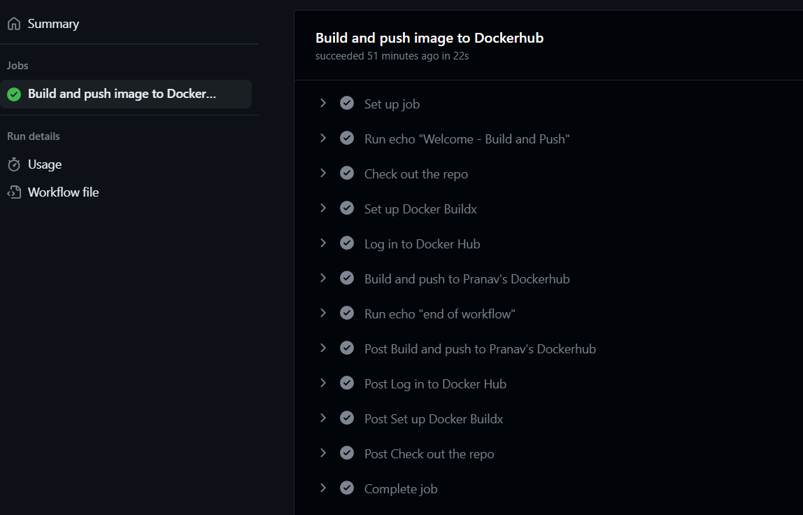

# Project 4
- Name: Pranav Ponugoti
- Email: ponugoti.16@wright.edu

## Part 1
### Documentation
- CI Project Overview
  - The purpose of this project is to learn how to use a set of platforms called "Docker".
  - Containerization is the way to deploy applications efficiently in many aspects.
  - Dockerfiles helps to create images and spin up the containers and use them anywhere by anyone. This helps to spin up any environment in less amount of time making use of memory efficiently.
  - It can be maintained in centrailized hub as well in the form of images with versions.
  - Docker is the tool used as part of this project along with github for git CI CD.
  - We majorly go through how to write a dockerfile followed by spinning up and seeing the content deployed and exposed to the internet using curl as well as public IP.

- Run Project Locally
  - how to install docker + dependencies (WSL2, for example)
    - I have installed docker and it's dependencies using commands on official docker documentation.
    - Using sudo apt-get, I have installed the docker and it's dependencies. Below is the source.
    - Commands are as follows:
```
# Add Docker's official GPG key:
sudo apt-get update
sudo apt-get install ca-certificates curl gnupg
sudo install -m 0755 -d /etc/apt/keyrings
curl -fsSL https://download.docker.com/linux/ubuntu/gpg | sudo gpg --dearmor -o /etc/apt/keyrings/docker.gpg
sudo chmod a+r /etc/apt/keyrings/docker.gpg

# Add the repository to Apt sources:
echo \
  "deb [arch="$(dpkg --print-architecture)" signed-by=/etc/apt/keyrings/docker.gpg] https://download.docker.com/linux/ubuntu \
  "$(. /etc/os-release && echo "$VERSION_CODENAME")" stable" | \
  sudo tee /etc/apt/sources.list.d/docker.list > /dev/null
sudo apt-get update
```
  
  - how to build an image from the `Dockerfile`
    - Building an image using Dockerfile:
    - `docker build -t <tagname> .`
    - where -t referes to tagname i.e., name associated to the image created and . refers to the location of Dockerfile. Here . refers to current directory.
  
  - how to run the container
    - Running docker container:
    - docker run -d -p 80:80 <imagename> - background, detached mode
    - docker run <imagename> - foreground
      - -p refers to portbinding (instanceport:containerport)
      - -d detached mode
  - how to view the project running in the container (open a browser...go to IP and port...)
    - Viewing project running:
        - In browser, Using IP of the instance, followed by the port it got hosted. (Screenshot attached)
        - In Ec2 instance, curl localhost:<portnumber> Ex: curl localhost

        - Inside the container to check the files/ modify:
    `docker exec -it <containerID or name> bash` - This will take you inside container and you can go the folder and  - change the contents.
  - 
  - 
  - [Reference](https://docs.docker.com/engine/install/ubuntu/)

## Part 2
### Documentation

 - Creation of public repo in DockerHub
    - Head over to https://hub.docker.com/
    - Sign up by giving username, password and email
    - Sign in and verify your email.
    - Click on repositories
    - Create repository.
    - Give repo name, choose public and click on create.
 - How to authenticate with DockerHub via CLI using Dockerhub credentials
    - Command to login from CLI: `sudo docker login -u <username>`
    - `sudo docker login -u pranavponugoti16` - My command.
    - It prompts for a password - If dockerhub password is given, that fails.
    - Here dockerhub access token has to be given. This has to be created as part of Account settings -> Security -> Access Tokens.
    - Once prompts comes for password, copy paste the access token. (Save it in someplace, as it can't be seen once you refresh)
    - Now we are able to login to docker using CLI. (Username and Access token are needed)
 - How to push container image to Dockerhub (without GitHub Actions)
    - In order to push the image to container, first tag the image with `reponame:version`
    - If there is an image with `oldimage:v1` to tag it, in order to push to `newrepo`, the command is `docker tag oldimage:v1 newrepo:v1`
    - A new image with `newrepo:v1` is created.
    - To push - `docker push newrepo:v1`
    - The change is reflected in dockerhub repo.
 - Configuring GitHub Secrets
    - How to set a secret
        - Head over to settings tab of repository(github)
        - Click on `Secrets and variables`, choose `Actions`
        - Click on `Repository secrets` and add the username and password by clicking on `New repository secret`
        - Add username and password in the repository secrets, please type the value of secrets, copy paste wouldn't work. Add username and access token for username and password respectively.
    - What secret(s) are set for this project
        - My secrets are : `DOCKER_USERNAME` and `DOCKER_PASSWORD`
 - Behavior of GitHub workflow
    - what does it do and when
        - My workflow works when something pushed to `main` branch.
        - The runner used is `ubuntu-latest`
        - The repo is checkout first, docker build is setup.
        - Docker login is done using github secrets username and password followed by docker build and push operations are done.
        - Pass the context, filename and push is set to `true` as docker image is pushed to dockerhub which is logged in previous step.
    - what variables in workflow are custom to your project
        - I have used secrets for `dockerhub username and password`, which can be managed easily at centralized location. (Names of them: `DOCKER_USERNAME` and `DOCKER_PASSWORD`)
        - As part of workflow, `reponame is set as environment variable` - `DOCKER_HUB_REPO`, which is set once and can be used multiple times in the workflow. As I have used only once as part of tag, it occured single time.
        - Similarly other variables can be added based on use case and various steps added in the pipeline.
 - Github workflow run log:
    - 

