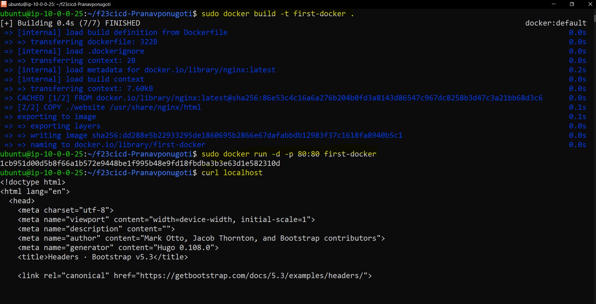
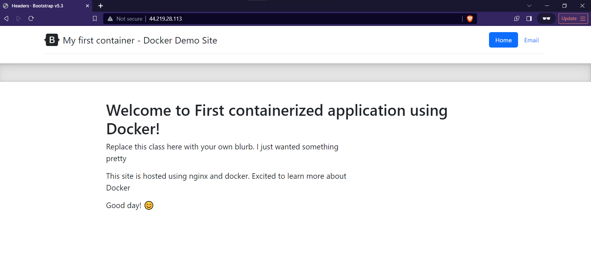

# Project 4
- Name: Pranav Ponugoti
- Email: ponugoti.16@wright.edu

### Documentation
- CI Project Overview
  - The purpose of this project is to learn how to use a set of platforms called "Docker".
  - Containerization is the way to deploy applications efficiently in many aspects.
  - Dockerfiles helps to create images and spin up the containers and use them anywhere by anyone. This helps to spin up any environment in less amount of time making use of memory efficiently.
  - It can be maintained in centrailized hub as well in the form of images with versions.
  - Docker is the tool used as part of this project along with github for git CI CD.
  - We majorly go through how to write a dockerfile followed by spinning up and seeing the content deployed and exposed to the internet using curl as well as public IP.

- Run Project Locally
  - how to install docker + dependencies (WSL2, for example)
  - I have installed docker and it's dependencies using commands on official docker documentation.
  - Using sudo apt-get, I have installed the docker and it's dependencies. Below is the source.
  - Commands are as follows:
```
# Add Docker's official GPG key:
sudo apt-get update
sudo apt-get install ca-certificates curl gnupg
sudo install -m 0755 -d /etc/apt/keyrings
curl -fsSL https://download.docker.com/linux/ubuntu/gpg | sudo gpg --dearmor -o /etc/apt/keyrings/docker.gpg
sudo chmod a+r /etc/apt/keyrings/docker.gpg

# Add the repository to Apt sources:
echo \
  "deb [arch="$(dpkg --print-architecture)" signed-by=/etc/apt/keyrings/docker.gpg] https://download.docker.com/linux/ubuntu \
  "$(. /etc/os-release && echo "$VERSION_CODENAME")" stable" | \
  sudo tee /etc/apt/sources.list.d/docker.list > /dev/null
sudo apt-get update
```
  
  - how to build an image from the `Dockerfile`
    - Building an image using Dockerfile:
    - `docker build -t <tagname> .`
    - where -t referes to tagname i.e., name associated to the image created and . refers to the location of Dockerfile. Here . refers to current directory.
  
  - how to run the container
    - Running docker container:
    - docker run -d -p 80:80 <imagename> - background, detached mode
    - docker run <imagename> - foreground
      - -p refers to portbinding (instanceport:containerport)
      - -d detached mode
  - how to view the project running in the container (open a browser...go to IP and port...)
    - Viewing project running:
    - In browser, Using IP of the instance, followed by the port it got hosted. (Screenshot attached)
    - In Ec2 instance, curl localhost:<portnumber> Ex: curl localhost

    - Inside the container to check the files/ modify:
  `docker exec -it <containerID or name> bash` - This will take you inside container and you can go the folder and  - change the contents.
  - 
  - 
  - [Reference](https://docs.docker.com/engine/install/ubuntu/)